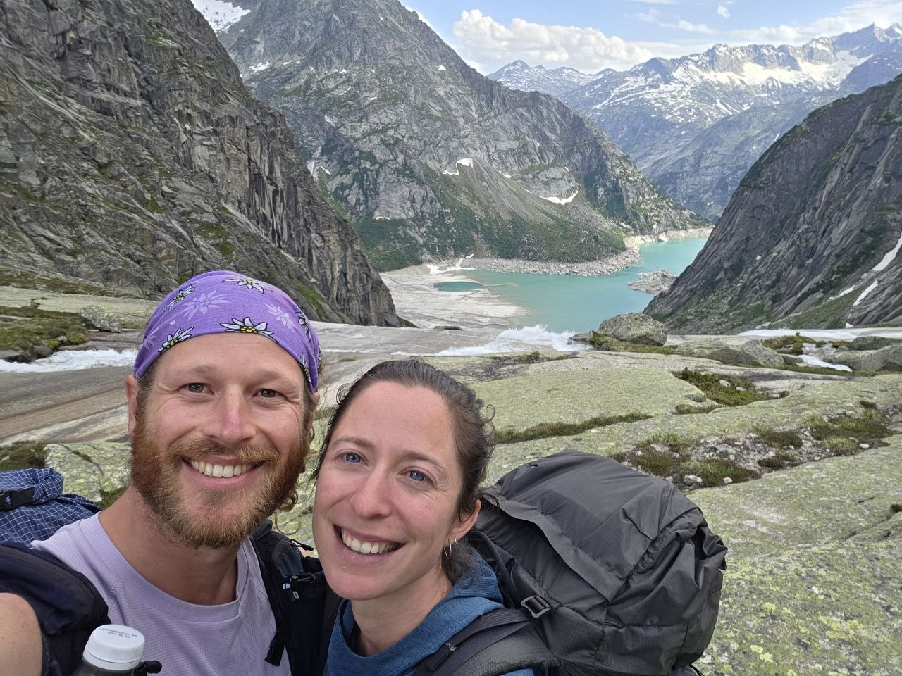
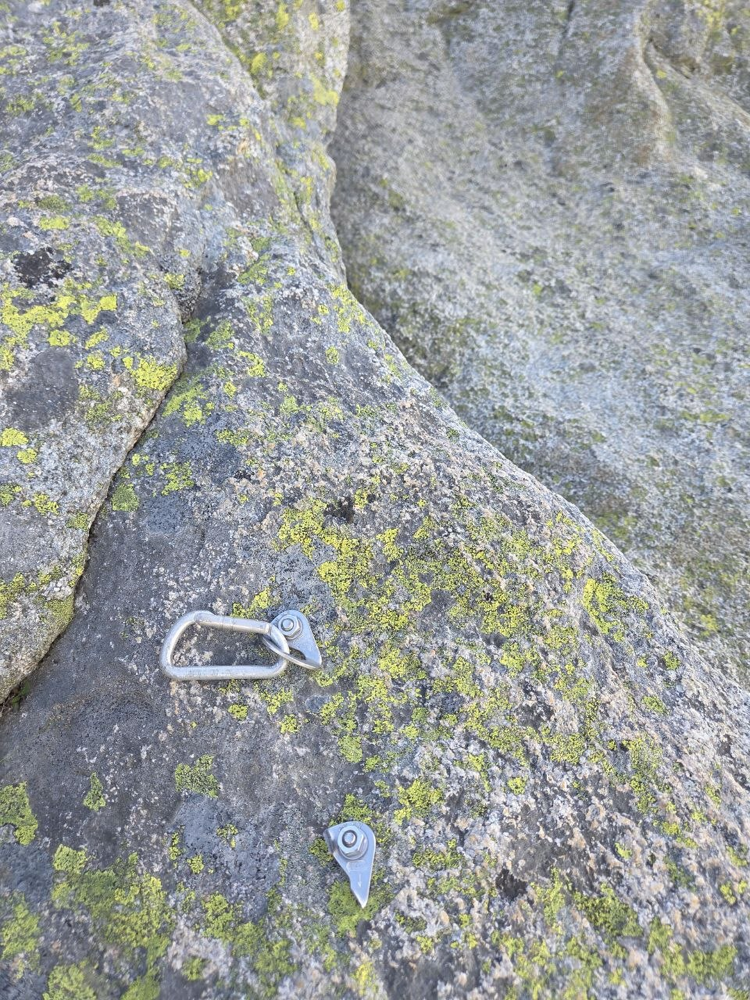
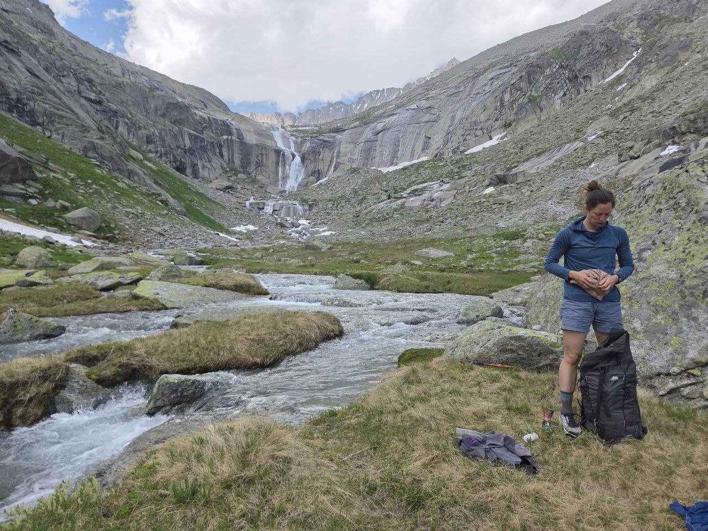
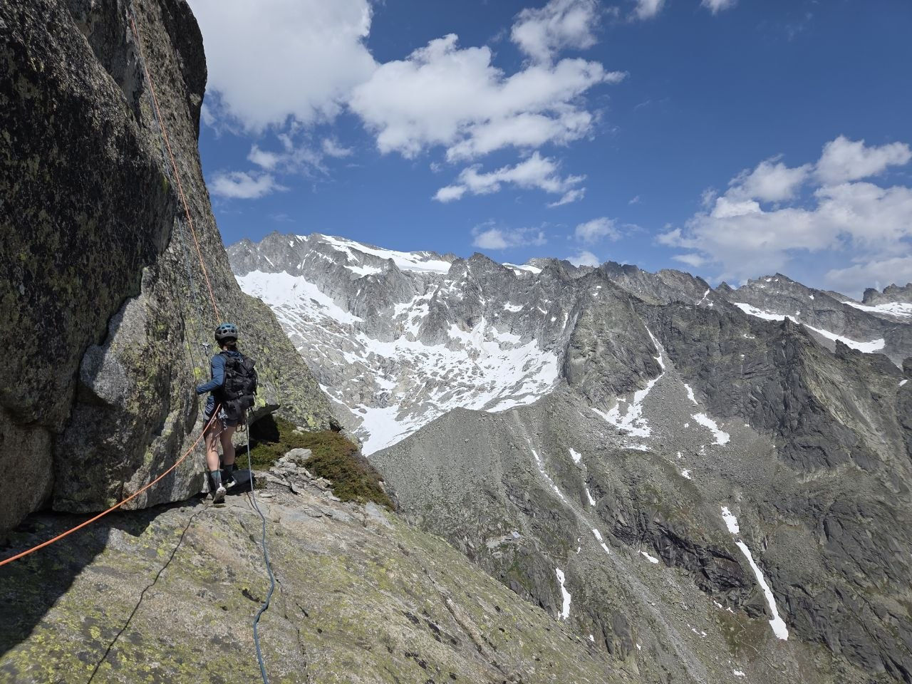
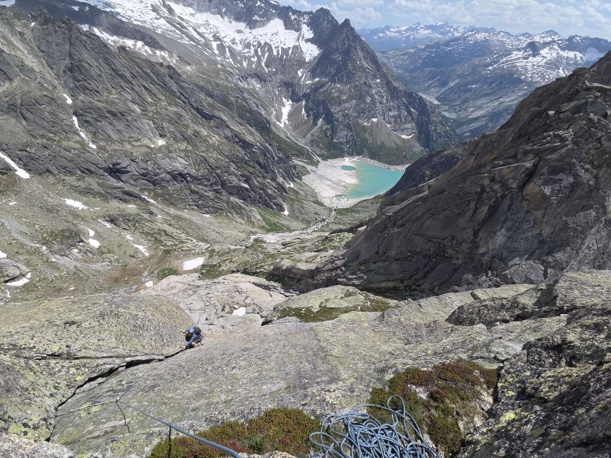
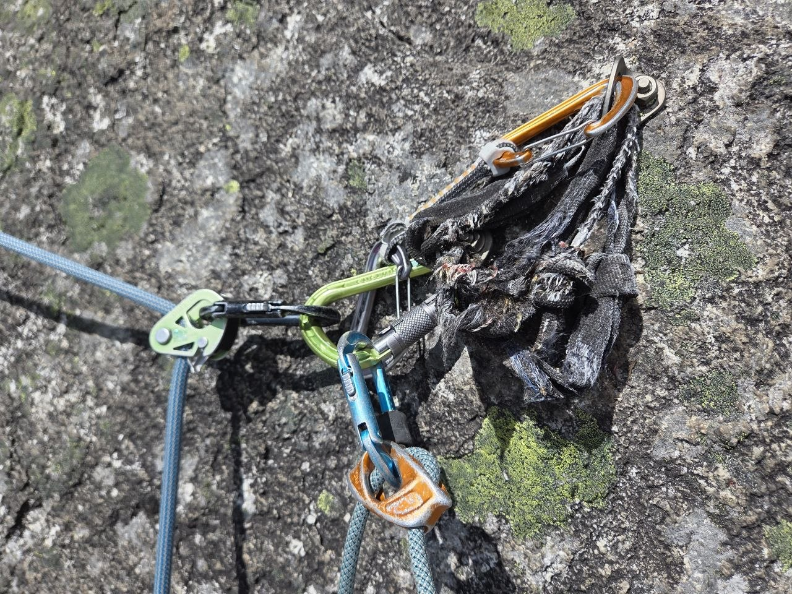
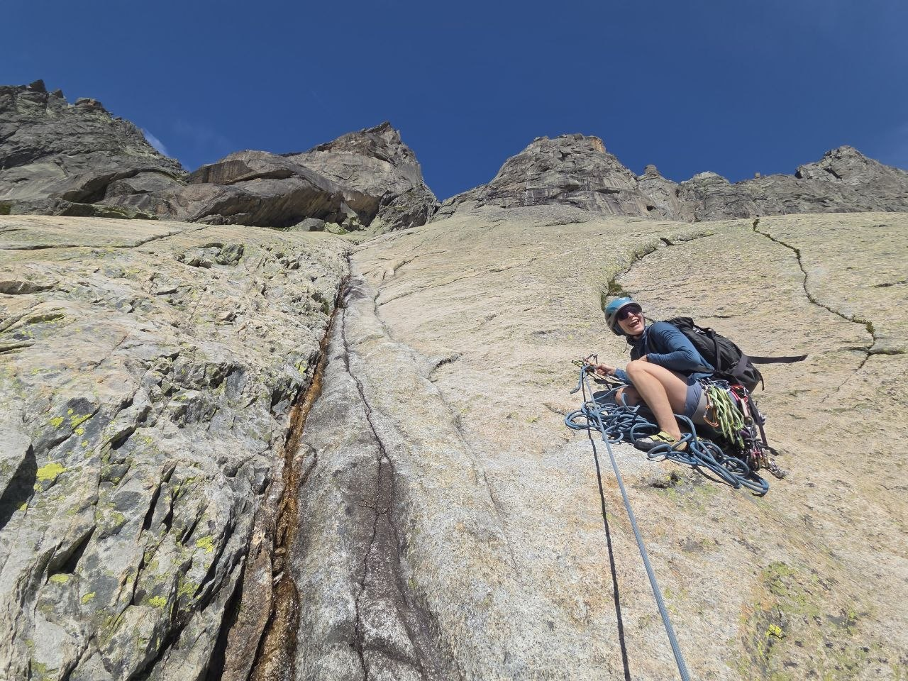
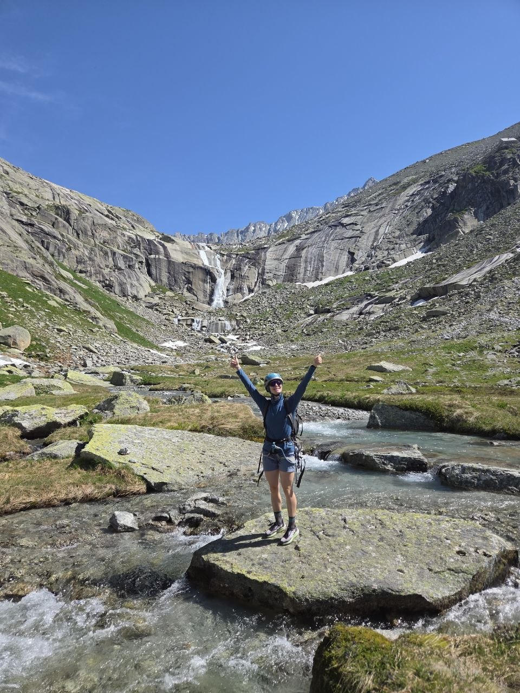

Okay, now we have the first real test of the voice blog. I will probably have a lot of long pauses while I'm thinking about the whole thing, and it'll also probably be an interesting test of the interpretation of proper nouns and also vocalized pauses and also sending multiple voice notes.

So this is about the trip to Gelmerhörn about two weeks ago. Yeah Silvana and I were not totally sure where to go and then decided on Gelmerhörn because we've both never been there and it's a really nice area in from Grimsel that's a lot less crowded and a lot quieter. It took about two hours for the approach which is quite long and we checked the weather on the way up and luckily it was not going to storm or anything. Silvana led the first half or so of the route which was like more low-angle run-out slab like you know like three bolts for like a 50 meter pitch. It's a bit of exploratory stuff, exploratory climbing. Yeah and then I led the second half of the route which was like on steeper granite, also like quite pretty challenging route finding. Yeah it's a lot more, there's a found out there's a reason it's not in the Pleisir guidebook. Obviously it's it's a you know it's a it's a it's a it's a it's a it's a it's a it's a it's a found out there's a reason it's not in the Pleisir guidebook. Obviously it's it's a yeah quite a bit challenging as far as the whole thing. Yeah the whole way up to the summit was like maybe like five hours or so and yeah like the rock top super super grippy, really nice, really awesome. And yeah the descent was also quite a adventure. There's like lots of shitty anchors and it was a bit challenging to like look around try to find the next uphill anchor because at one point you'd you know like abseil three times and then walk down a bit and then have to look for the other anchor kind of thing.

And then we got down, went swimming, and then had a nice walk back down to the car.

